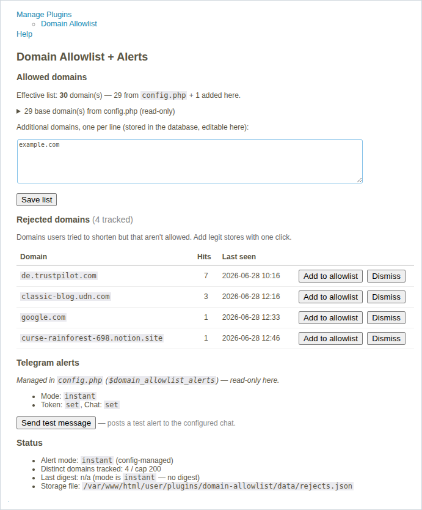

# Domain Allowlist + Alerts (YOURLS plugin)

[](https://github.com/YOURLS/awesome)

Restrict URL shortening to an allowlist of domains, and — optionally — get a
Telegram heads-up when someone tries to shorten a domain that **isn't** on the
list. That rejected-domain signal tells you which destinations your users
actually want, so you can grow the allowlist on demand instead of guessing.

Self-contained by design: **no extra database table, no cron job, no server
configuration.** Rejected-domain stats live in a single size-bounded JSON file,
and the periodic digest piggybacks on normal site traffic ("lazy cron").



## Features

- Allow shortening only for hosts on a configurable list. Matching is exact host
  **or any subdomain** — `example.com` also matches `www.example.com` and
  `go.example.com`, but not `notexample.com`.
- **Drop-in config compatibility** with the classic
  [nicwaller/yourls-domainlimit](https://github.com/nicwaller/yourls-domainlimit-plugin):
  it reuses `$domainlimit_list` and `$domainlimit_exempt_users`, so existing
  installs can switch with no config changes.
- Optional **Telegram alerts** about rejected domains:
  - `instant` — the first time a new domain is rejected (throttled), and/or
  - `digest` — a periodic "top rejected domains" summary.
- **Anti-spam / anti-ban throttling**: a per-domain cooldown, a global minimum
  gap between any two sends, and short network timeouts — all fire-and-forget,
  so a slow or failing Telegram call never blocks or breaks a shorten request.
- Returns structured data (`disallowed_host`, `allowed_domains`) in the error
  result so a custom theme can render a friendly "domain not allowed" page.
- **Admin settings page** (Plugins → Domain Allowlist): edit an extra allowlist,
  one-click-allow domains straight from the list of rejected attempts, manage the
  Telegram settings, and send a test message — all without touching a file.
- PHP 8.x clean. No external dependencies.

## Install

1. Put `plugin.php` in a folder under `user/plugins/` (e.g. `user/plugins/domain-allowlist/`).
2. Activate **Domain Allowlist + Alerts** on the YOURLS admin Plugins page.
3. Configure it in `user/config.php` (below) **or** on the plugin's admin
   settings page (Plugins → Domain Allowlist).

## Configuration (`user/config.php`)

```php
// Required — the allowed domains (exact host or any subdomain).
$domainlimit_list = array(
    'example.com',
    'example.org',
);

// Optional — logged-in users that bypass the check entirely.
$domainlimit_exempt_users = array( 'admin' );

// Optional — override the rejection message (a generic default is used otherwise).
$domain_allowlist_message = 'Only links from approved domains can be shortened here.';

// Optional — Telegram alerts about rejected domains. Omit the whole block to
// disable alerting (the domain restriction still works).
$domain_allowlist_alerts = array(
    'telegram_token'      => '123456:ABC-DEF...', // @BotFather token
    'telegram_chat'       => '-1001234567890',    // chat / group / channel id
    'mode'                => 'both',              // instant | digest | both | off
    'per_domain_cooldown' => 21600,               // re-alert same domain after N s (default 6h)
    'global_min_gap'      => 30,                   // min seconds between any two sends
    'digest_interval'     => 86400,               // digest cadence in seconds (default 24h)
    'max_hosts'           => 200,                  // cap on stored distinct domains
    'store_path'          => '',                   // '' = auto (plugin data/ -> system temp)
);
```

## Config file vs admin page

Both work, and **`config.php` takes precedence**:

- **Allowlist** — `$domainlimit_list` in `config.php` is the read-only base; the
  admin page manages an *additional* list stored in the database, and the
  effective allowlist is the **union** of the two. "Add to allowlist" on a
  rejected domain appends to that admin list. (A plugin can't write `config.php`,
  so GUI-added domains live in the DB.)
- **Alerts & message** — if `$domain_allowlist_alerts` / `$domain_allowlist_message`
  are set in `config.php`, they win and the admin fields are read-only; otherwise
  they're editable on the admin page and stored in the database.

## How storage and the digest work (no DB, no cron)

- **Storage** is one JSON file holding a map of `host -> {hits, first_seen,
  last_seen, last_notified}` plus two timestamps. It is updated under an
  exclusive file lock (`flock`); the network send happens *after* the lock is
  released, so concurrent shorten requests never wait on Telegram.
- The map is **hard-capped** at `max_hosts` entries (least-recently-seen are
  evicted), so the file size is bounded — there is no risk of filling the disk
  the way an append-only log would.
- The file lives in the plugin's `data/` directory if it is writable, otherwise
  in the system temp directory, or wherever `store_path` points.
- The **digest is traffic-driven**: every rejection checks whether
  `digest_interval` has elapsed since the last digest and, if so, sends one.
  No real cron is needed — ordinary site traffic does the ticking.

## Scale and caveats

- Tuned for **small/medium shorteners**. On very high traffic prefer
  `mode => 'digest'` with a larger `digest_interval` to keep Telegram quiet.
- Because the digest is traffic-driven, a site with no traffic sends nothing
  (there is nothing to report anyway).
- State is **per-server**: on a multi-server / load-balanced setup, throttling
  and the digest are tracked independently on each node.
- Alerts need a **writable** storage location. If none is writable the plugin
  disables alerting and shows an admin notice (it will not send unthrottled).

## License

GPL-2.0-or-later. See [LICENSE](LICENSE).
